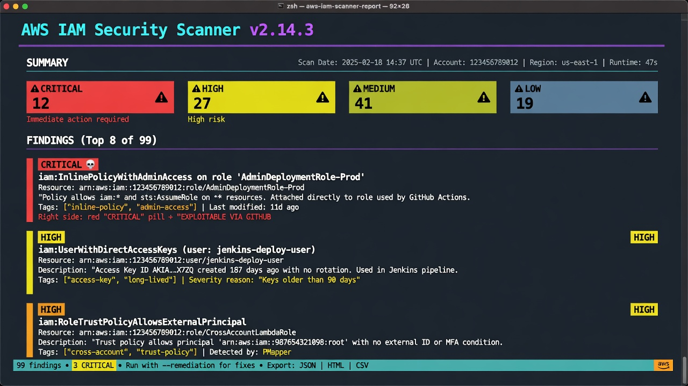
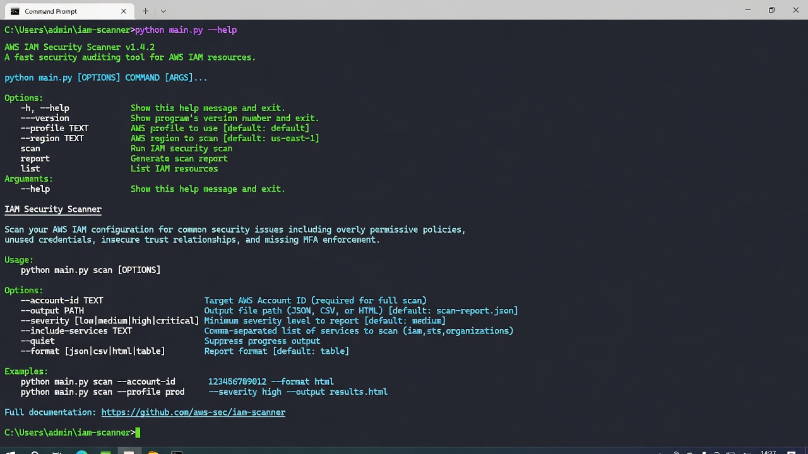
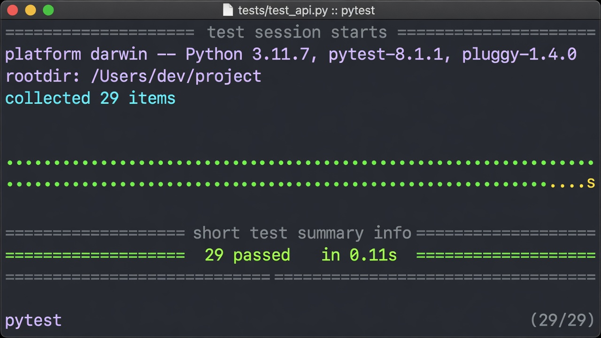
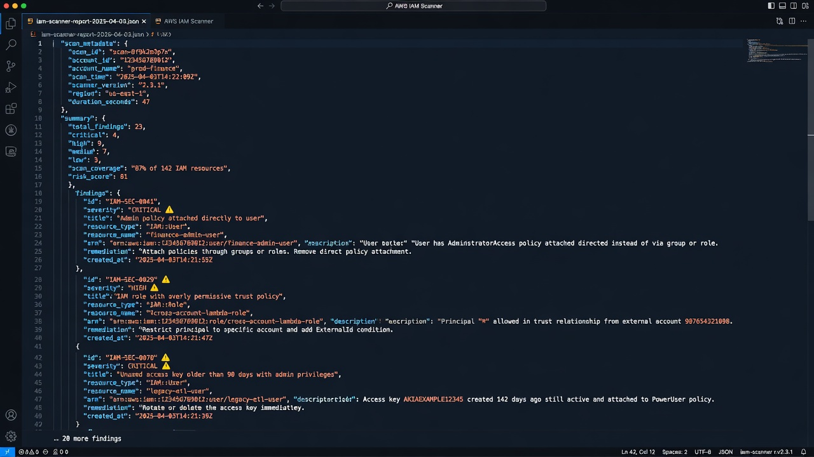

# AWS IAM Security Scanner

A Python-based security tool that scans AWS IAM configurations for 
misconfigurations, privilege escalation paths, and compliance gaps.



---

## Why I Built This

IAM misconfiguration is the **#1 cause** of AWS account compromise. Tools like this automate what a security engineer would manually check during a cloud security audit. 
The goal was to understand both the **attack surface** (what misconfigurations enable privilege escalation) and the **detection logic** (how to programmatically identify them at scale).

---

## What Problem Does This Solve?

Misconfigured IAM policies remain one of the leading causes of cloud breaches. This tool 
automatically detects dangerous permission patterns that manual audits 
miss, and generates actionable remediation steps.

---

## Key Features

- Detects overly permissive IAM policies (wildcard actions and resources)
- Identifies users with console access but no MFA enabled
- Flags stale and unrotated access keys
- Detects privilege escalation permissions (e.g., iam:CreatePolicyVersion, iam:PassRole, iam:AttachUserPolicy)
- Analyzes role trust policies for overly permissive principals (`*`) and missing ExternalId conditions
- Checks account password policy strength
- Flags direct policy attachments to users instead of groups
- Custom CVSS-inspired risk scoring with contextual modifiers
- Colorized terminal reports + exportable JSON reports
- Support for **live AWS scanning** and **offline file-based analysis**
- Loads pre-collected IAM data (compatible with exported JSON or tools like BishopFox iam-vulnerable)
- Uses AWS paginators for reliable results on large accounts
- Fully read-only — no changes are made to your AWS environment
- Comprehensive unit tests using mocked data

---

## Tech Stack

| Tool              | Purpose                                      |
|-------------------|----------------------------------------------|
| Python 3.x        | Core language                                |
| Boto3             | AWS SDK for IAM data collection              |
| colorama          | Colored terminal output                      |
| python-dateutil   | Timezone-aware datetime handling             |
| pytest            | Unit testing with mocked IAM data            |

---

## Project Structure

```
iam-scanner/
├── scanner/
│   ├── __init__.py
│   ├── iam_collector.py       # Collects IAM data (live or from file)
│   ├── policy_parser.py       # Analyzes policy documents
│   ├── rule_engine.py         # Runs all 12 security rules
│   ├── risk_scorer.py         # Calculates risk scores
│   └── report_generator.py    # Terminal + JSON reporting
├── rules/
│   └── rules_config.json      # Rule metadata
├── output/                    # Generated reports
├── tests/
│   └── test_rules.py          # Unit tests (29 tests)
├── main.py                    # CLI entry point
└── requirements.txt
```

---

## Setup

1. Clone the repository:
   ```bash
   git clone https://github.com/your-username/iam-scanner.git
   cd iam-scanner
   ```

2. Install dependencies:
   ```bash
   pip install -r requirements.txt
   ```

3. Configure AWS credentials (one of the following):
   - Run `aws configure`
   - Use a named profile: `--profile myprofile`
   - Set environment variables (`AWS_ACCESS_KEY_ID`, `AWS_SECRET_ACCESS_KEY`)

> **Note**: The scanner is read-only. It only requires `iam:*` read/list permissions. The `ReadOnlyAccess` AWS managed policy works well.

---

## Usage

### Live AWS Scan (Default)

```bash
python main.py
```

Common options:

```bash
# Filter by severity
python main.py --severity HIGH

# Output formats
python main.py --output both
python main.py --output json

# Use a specific AWS profile
python main.py --profile production

# Filter by entity type
python main.py --entity-type USER
```

### File Mode (Offline / Pre-collected Data)

Load data from a previously exported JSON file. Useful for:
- Offline analysis
- CI/CD pipelines
- Testing with synthetic data (e.g. from BishopFox iam-vulnerable)

```bash
python main.py --data-source file --input-file exported_data.json

# Combine with other options
python main.py --data-source file --input-file data.json --severity CRITICAL --output both
```

**Example comment in code**:
```bash
# python main.py --data-source file --input-file exported_data.json
```

---

## Screenshots

### CLI Help

```bash
python main.py --help
```



<details>
<summary>Click to view CLI help text</summary>

```text
usage: main.py [-h] [--severity {CRITICAL,HIGH,MEDIUM,LOW,INFO}]
               [--output {terminal,json,both}]
               [--entity-type {USER,ROLE,GROUP,ACCOUNT}] [--profile PROFILE]
               [--data-source {live,file}] [--input-file INPUT_FILE]

AWS IAM Security Misconfiguration Scanner

options:
  -h, --help            show this help message and exit
  --severity {CRITICAL,HIGH,MEDIUM,LOW,INFO}
                        Minimum severity to include in report (default: show
                        all)
  --output {terminal,json,both}
                        Output format (default: terminal)
  --entity-type {USER,ROLE,GROUP,ACCOUNT}
                        Filter findings to specific entity type (default: all)
  --profile PROFILE     AWS profile name to use from ~/.aws/credentials
                        (default: default profile)
  --data-source {live,file}
                        Source of IAM data: 'live' to query AWS in real-time,
                        or 'file' to load from a pre-collected JSON (default:
                        live)
  --input-file INPUT_FILE
                        Path to JSON file containing IAM data (required when
                        --data-source=file)

Examples:
  python main.py
  python main.py --severity CRITICAL --output both
  python main.py --profile prod --entity-type ROLE
  python main.py --output json --severity HIGH

  # Load data from exported JSON file (no live AWS calls)
  python main.py --data-source file --input-file exported_data.json
```
</details>


### Terminal Report Example

When running against data that triggers multiple misconfigurations:


**Example text output** (colorized in actual terminal):

```
============================================================
  AWS IAM SECURITY SCAN REPORT
  Account: 123456789012 | 2026-06-24T12:00:00Z
============================================================

SUMMARY
  Total Findings : 6
  CRITICAL       : 2 
  HIGH           : 2
  MEDIUM         : 2
  LOW            : 0

------------------------------------------------------------
[CRITICAL] RULE_003 — WILDCARD_ADMIN_POLICY
Entity       : arn:aws:iam::123456789012:user/alice
Type         : USER
CVSS Score   : 9.5
Description  : Policy 'AdminInline' attached to USER 'alice' grants full administrative access (Action:* Resource:*).
Remediation  : Replace with least-privilege policy specifying only required actions and resources.
------------------------------------------------------------
[CRITICAL] RULE_007 — OVERLY_PERMISSIVE_TRUST_POLICY
Entity       : arn:aws:iam::123456789012:role/OpenRole
Type         : ROLE
CVSS Score   : 9.5
Description  : Role 'OpenRole' has a trust policy that allows any principal to assume it.
...
```

### Test Results

```bash
python -m pytest tests/test_rules.py -v
```



```text
.............................                                            [100%]
29 passed in 0.11s
```

> **Note**: The images currently in `screenshots/` are illustrative mockups. 
> Replace them with real captures from your machine for the best results.
>
> **Tip**: To create real screenshots, run these commands and capture your terminal:
> - `python main.py --help`
> - `python main.py --data-source file --input-file your-data.json --output terminal`
> - `python -m pytest tests/test_rules.py -v`
>
> Recommended filenames: `cli-help.jpg`, `terminal-report.jpg`, `tests-passing.jpg`, `json-report.jpg`

### JSON Report Example

Reports are saved to `output/scan_report_*.json` with full structured data.



---

## Available Detection Rules

The scanner implements 12 rules:

| Rule ID  | Name                                      | Severity  |
|----------|-------------------------------------------|-----------|
| RULE_001 | Root account has no MFA                   | CRITICAL  |
| RULE_002 | IAM user has console access but no MFA    | HIGH      |
| RULE_003 | Policy grants full administrative access (`*:*`) | CRITICAL |
| RULE_004 | Stale access key (unused > 90 days)       | HIGH      |
| RULE_005 | Access key older than 90 days             | MEDIUM    |
| RULE_006 | Inline policy with wildcard permissions   | HIGH      |
| RULE_007 | Overly permissive role trust policy (`*`) | CRITICAL  |
| RULE_008 | Privilege escalation permissions          | HIGH      |
| RULE_009 | Weak account password policy              | MEDIUM    |
| RULE_010 | Direct policy attachment to user          | LOW       |
| RULE_011 | Cross-account trust without ExternalId    | HIGH      |
| RULE_012 | Broad permissions with no conditions      | MEDIUM    |

---

## Output

- **Terminal Report**: Color-coded by severity with descriptions and remediation steps.
- **JSON Report**: Saved to `output/scan_report_YYYYMMDD_HHMMSS.json` containing full metadata, summary counts, and all findings sorted by risk score.

Example summary:
```
Total Findings : 7
CRITICAL       : 2
HIGH           : 3
MEDIUM         : 2
LOW            : 0
```

---

## Project Status

Completed — core functionality is fully implemented and tested.

- Live IAM collection with full pagination
- Policy parsing and 12 security rules
- Risk scoring
- Terminal + JSON reporting
- File-based data source support for offline use

---

## Author

Vanshikha | B.Tech Cybersecurity, SSPU Pune  
(https://www.linkedin.com/in/vanshikha-panwar/)
